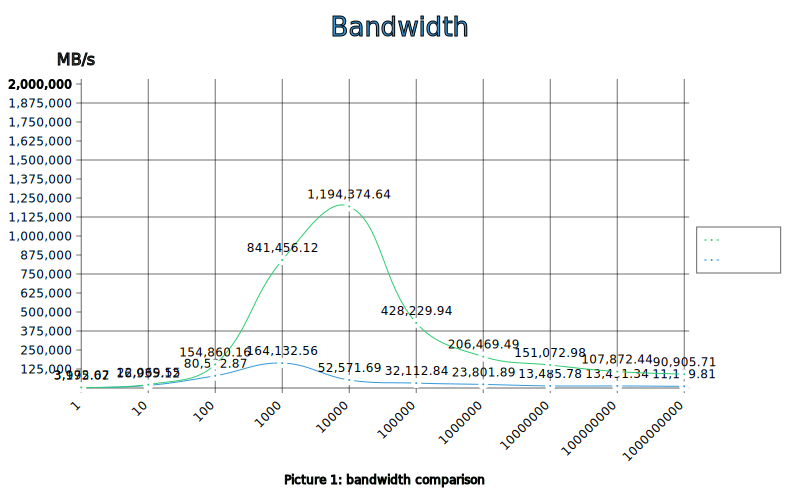

# Memcpy

Vectorised memory copying of array of bytes or uint64 numbers.

## Usage

The minimal working example:
```go
import "github.com/koykov/simd/memcpy"

var a = []uint64{0xFFFFFFFFFFFFFFFF, ..., 0xFFFFFFFFFFFFFFFF} // very big slice
dst := make([]uint64, len(a))
memcpy.Copy64(dst, a)
println(dst) // the same contents
```

The solution is optimized for very long input data.

## Copy bytes slice

Package also provides [`Copy`](bytes.go) method, that copies bytes slice.

## Copy raw memory

Package provides unsafe version [CopyUnsafe](unsafe.go) method. Use with caution! Pointers must point to a memory blocks
without heap pointers, memory leak may occur otherwise.

## Performance

Comparison between native `copy` function and memcpy64.Copy - copy contents of array of uint64 numbers:
```
BenchmarkMemcpy64/generic/1-8                        477337251            2.519 ns/op   3175.67 MB/s           0 B/op          0 allocs/op
BenchmarkMemcpy64/generic/10-8                       250577528            4.724 ns/op   16935.12 MB/s          0 B/op          0 allocs/op
BenchmarkMemcpy64/generic/100-8                      120206377            9.938 ns/op   80502.87 MB/s          0 B/op          0 allocs/op
BenchmarkMemcpy64/generic/1000-8                      24401158            48.74 ns/op   164132.56 MB/s         0 B/op          0 allocs/op
BenchmarkMemcpy64/generic/10000-8                       783532             1522 ns/op   52571.69 MB/s          0 B/op          0 allocs/op
BenchmarkMemcpy64/generic/100000-8                       46424            24912 ns/op   32112.84 MB/s          0 B/op          0 allocs/op
BenchmarkMemcpy64/generic/1000000-8                       3560           336108 ns/op   23801.89 MB/s          0 B/op          0 allocs/op
BenchmarkMemcpy64/generic/10000000-8                       204          5932172 ns/op   13485.78 MB/s          0 B/op          0 allocs/op
BenchmarkMemcpy64/generic/100000000-8                       18         59297315 ns/op   13491.34 MB/s          0 B/op          0 allocs/op
BenchmarkMemcpy64/generic/1000000000-8                       2        714936426 ns/op   11189.81 MB/s          0 B/op          0 allocs/op

BenchmarkMemcpy64/avx512/1-8                         599937378            2.004 ns/op   3992.02 MB/s           0 B/op          0 allocs/op
BenchmarkMemcpy64/avx512/10-8                        330919657            3.625 ns/op   22069.55 MB/s          0 B/op          0 allocs/op
BenchmarkMemcpy64/avx512/100-8                       234558537            5.166 ns/op   154860.16 MB/s         0 B/op          0 allocs/op
BenchmarkMemcpy64/avx512/1000-8                      130547935            9.507 ns/op   841456.12 MB/s         0 B/op          0 allocs/op
BenchmarkMemcpy64/avx512/10000-8                      17826741            66.98 ns/op   1194374.64 MB/s        0 B/op          0 allocs/op
BenchmarkMemcpy64/avx512/100000-8                       632268             1868 ns/op   428229.94 MB/s         0 B/op          0 allocs/op
BenchmarkMemcpy64/avx512/1000000-8                       30918            38747 ns/op   206469.49 MB/s         0 B/op          0 allocs/op
BenchmarkMemcpy64/avx512/10000000-8                       1968           529545 ns/op   151072.98 MB/s         0 B/op          0 allocs/op
BenchmarkMemcpy64/avx512/100000000-8                       160          7416167 ns/op   107872.44 MB/s         0 B/op          0 allocs/op
BenchmarkMemcpy64/avx512/1000000000-8                       13         88003269 ns/op   90905.71 MB/s          0 B/op          0 allocs/op
```
See Picture 1 for graphical representation:


